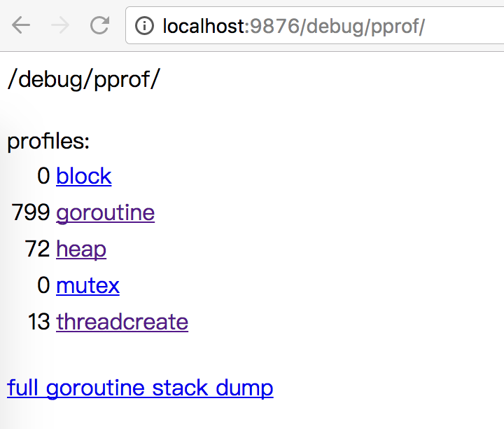
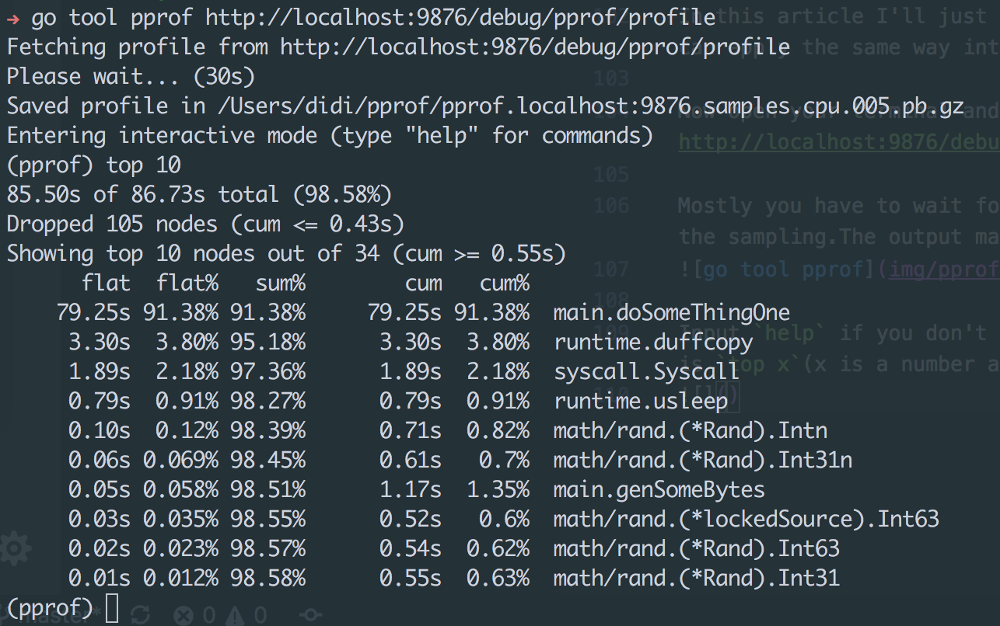
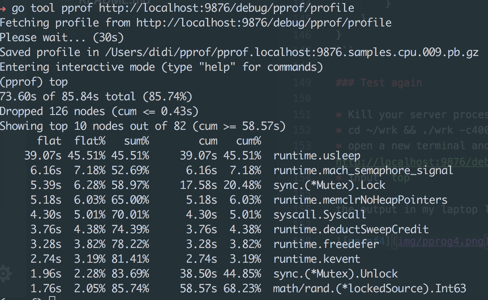
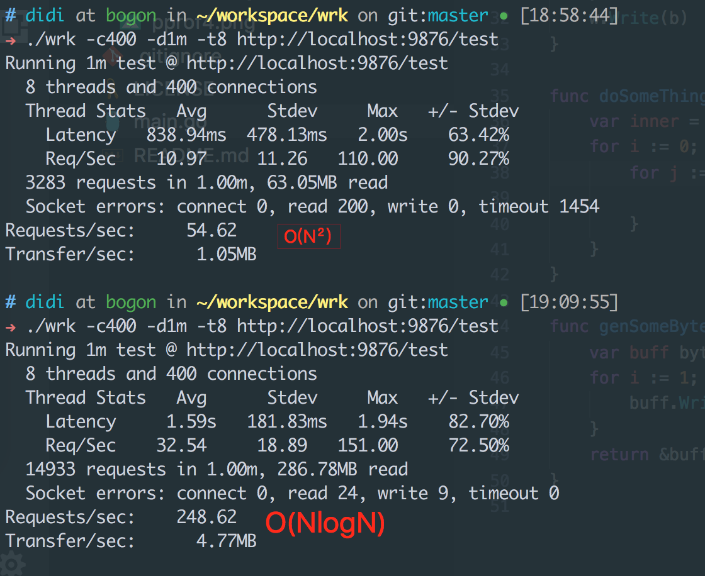
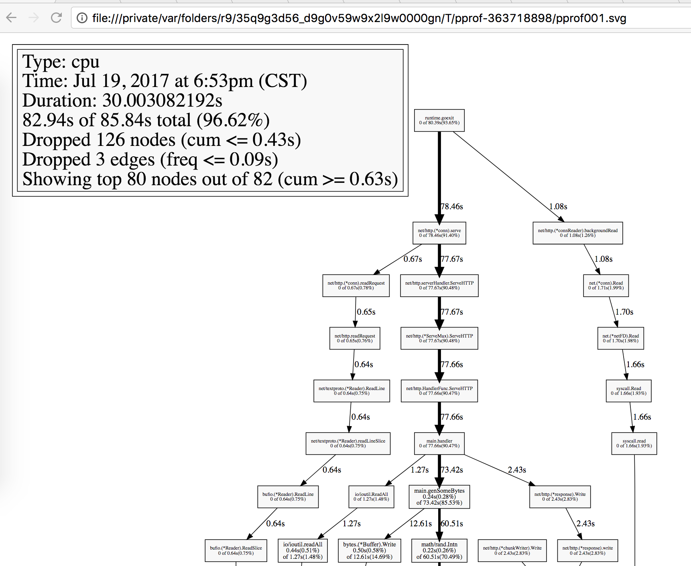
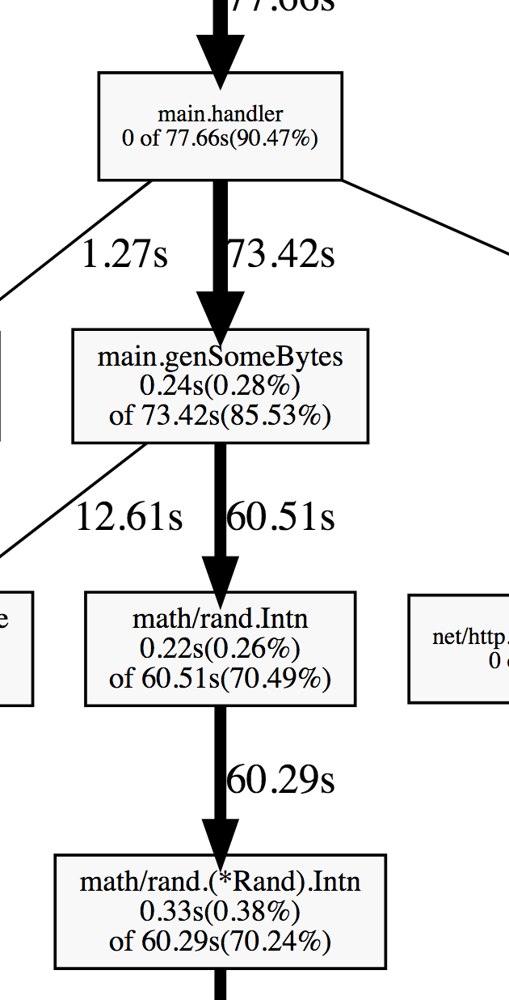
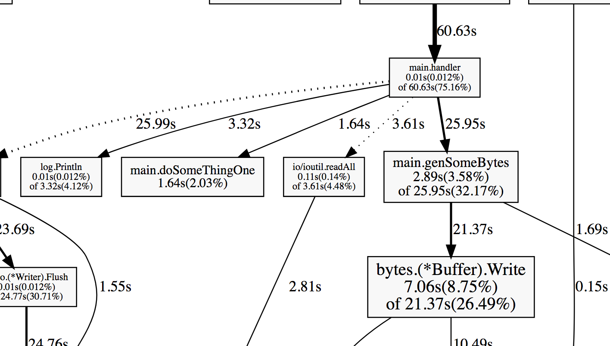
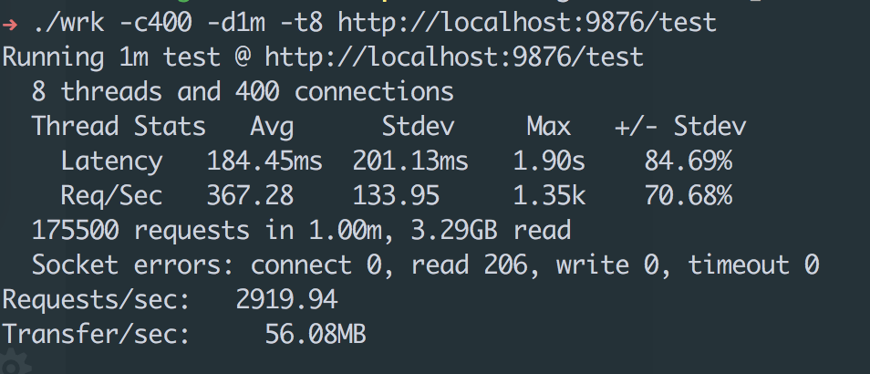
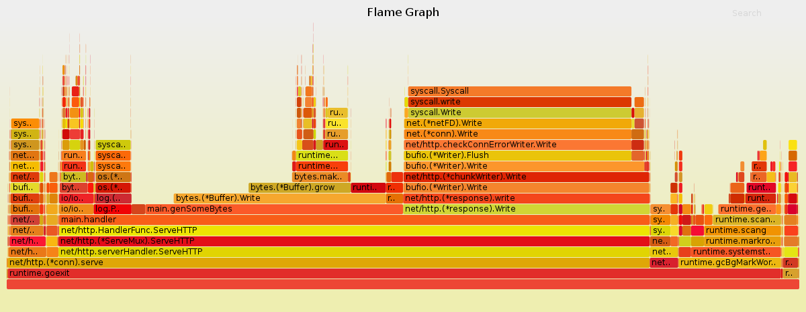

# Tutorial for optimizing golang program

> Inspired By cch123's article [pprof 和火焰图](http://xargin.com/pprof-he-huo-yan-tu/)

There're lots of powerful tools for optimizing golang program and some of those you may have already known but still not used it.So let's get start from a very simple demo,the `main.go`

*Follow the article and change the `main.go` yourself when needed*

But first of all let's have a glimpse of it:

``` go
package main

import (
	"bytes"
	"io/ioutil"
	"log"
	"math/rand"
	"net/http"
	_ "net/http/pprof"
)

func main() {
	http.HandleFunc("/test", handler)
	log.Fatal(http.ListenAndServe(":9876", nil))
}

func handler(w http.ResponseWriter, r *http.Request) {
	err := r.ParseForm()
	if nil != err {
		w.Write([]byte(err.Error()))
		return
	}
	log.Println(r.Form)
	doSomeThingOne(10000)
	buff := genSomeBytes()
	b, err := ioutil.ReadAll(buff)
	if nil != err {
		w.Write([]byte(err.Error()))
		return
	}
	w.Write(b)
}

func doSomeThingOne(times int) {
	for i := 0; i < times; i++ {
		for j := 0; j < times; j++ {

		}
	}
}

func genSomeBytes() *bytes.Buffer {
	var buff bytes.Buffer
	for i := 1; i < 20000; i++ {
		buff.Write([]byte{'0' + byte(rand.Intn(10))})
	}
	return &buff
}
```

Make sure you have imported the `net/http/pprof` at the top of the code.

The demo above is very simple, it sets up a server and handles the request with the function, `handler`.The handler does three things:

* ParseForm
* doSomeThingOne
* genSomeBytes

all of them are aiming to simulate the reality.

Then you can run `go run main.go` to start the server.

## Mock Requests

Actually, to optimize your system you should know the bottleneck of it therefore you need put the server into a very busy condition just as in production.That's what [wrk](https://github.com/wg/wrk) does.

For more detail about the `wrk`,see its [github page](https://github.com/wg/wrk)

#### Install wrk

To install the `wrk`,you need only:

* git clone https://github.com/wg/wrk.git
* cd wrk
* make

**wrk relies on the openssl and luajit, learn more from its github page**

#### Generating requests

Our demo is listening on the port *9876*,so let's generate some requests for that.

`./wrk -c400 -t8 -d5m http://localhost:9876/test` 

* `-c400` means we have 400 connections to keep open
* `-t8` means we use 8 threads to build requests
* `-d5m` means the duration of the test will last for 5 minutes

#### pprof

Our server is very busy now and we can see some information via browser.
Input `localhost:9876/debug/pprof` you will see:



The information in this page can't help you find the bottleneck or the bug directly.
* If you think your system is not as fast as you expect, see `localhost:9876/debug/pprof/profile`.
* If you want to optimize the memory, see `localhost:9876/debug/pprof/heap`

In this article I'll just show you how to find the bottleneck in profile,but you can apply the same way into finding the bottleneck of memory.

Now open your terminal and run `go tool pprof http://localhost:9876/debug/pprof/profile` and see what will happen.

Mostly you have to wait for 30s to see the output because pprof need time to do the sampling.The output maybe look like:


*Tip: Input `help` if you don't know what to do*

One of the most important commands in pprof is `top x`(x is a number and default 10).



The report of `top 10` is divided into six rows
* `flat`: How much time was spent to run the function which is showed in the last column.
* `cum`: How much time was spend to run the function and functions invoked by it.
* `sum%`: sum%(line(i)) = flat%(line(i)) + sum%(line(i-1))

*The latest output from pprof is different from what you maybe learned before from [Profiling Go Programs](https://blog.golang.org/profiling-go-programs), but it doesn't matter*

You can dope out the meaning of other fields.

### Analyse

You can learn easily from the report that our server spent 79.25s out of 86.73s on the function `main.doSomethingOne`.If we can optimize it to make it run faster,it'll be a huge step forward.

So let's look at the code and see what the function `doSomethingOne` on earth do.

``` go
func doSomeThingOne(times int) {
	for i := 0; i < times; i++ {
		for j := 0; j < times; j++ {

		}
	}
}
```
Assume that the `doSomeThingOne` implements an O(N²) algorithim say, the bubble sort.In fact the bubble sort is not always a good choice so we could change `doSomeThingOne` and implement it with the merge sort(O(NlogN)):
``` go
func doSomeThingOne(times int) {
    var inner = int(math.Log2(float64(times)))
	for i := 0; i < times; i++ {
		for j := 0; j < inner; j++ {

		}
	}
}
```

### Test again

* Kill your server process and `go run main.go` again
* cd ~/wrk && ./wrk -c400 -t8 -d5m http://localhost:9876/test
* open a new terminal and run `go tool pprof http://localhost:9876/debug/pprof/profile`
* input `top`

the output in my laptop look like:



You may ask where's the`doSomeThingOne`?
In fact it spent so little time out of 85.84s that has been ignored by the counter.
Before we change the `doSomeThingOne` from O(N²) to O(NlogN),it spent 79.25s out of 86.73s.In our code N equals 10000 so NlogN is around 769 times faster than N².
79s/769 ≈ 0.1s so yes,the result is reasonable.

### Effort
How many times our handler run faster than that before?
We could find the answer by `wrk`


Just `Five times` faster and far less than we expected.There were many reasons,even how we use the `wrk` is one of them, but these're not in the scope of this article.

### Optimize again

In my eyes,the report of `go tool pprof` is not so intuitive.We have more powerful tools, yes, the graph.

But before we use it we need install `Graphviz` first.

On OSX,just run:

`brew install graphviz`

For other platforms see [here](https://github.com/ellson/graphviz)

After have the `graphviz` installed, in the go tool pprof interaction panel, input `web` instead of `top` now, and it'll produce a svg file.Open it in the browser or anything else you like and you'll see a graph like this.



Very intuitive right?

Now, follow the thickest arrow, you can learn from the graph that most of time is spent on the function `genSomeBytes`



So we should come up with an idea to make it run faster! But let's look at it firstly:

``` go
func genSomeBytes() *bytes.Buffer {
	var buff bytes.Buffer
	for i := 1; i < 20000; i++ {
		buff.Write([]byte{'0' + byte(rand.Intn(10))})
	}
	return &buff
}
```

From the graph above we can learn than most of time in `genSomeBytes` is spent on `rand.Intn`.But to tell the truth it's not easy to optimize packages in stdlib,but the purpose of this article is to teach you how to find the bottleneck,so I just change the `rand.Intn` to a constant,but you should know they're not equivalent in fact.

The `genSomeBytes` after modifying:

``` go
func genSomeBytes() *bytes.Buffer {
	var buff bytes.Buffer
	for i := 1; i < 20000; i++ {
		buff.Write([]byte{'0' + byte(i%10)})
	}
	return &buff
}
```

### Generate pprof graph again

* Kill your server process and `go run main.go` again
* cd ~/wrk && ./wrk -c400 -t8 -d5m http://localhost:9876/test
* open a new terminal and run `go tool pprof http://localhost:9876/debug/pprof/profile`
* input `web`
* open the svg file

And something maybe like:



You can see in the graph that most time spent on `genSomeBytes` is no longer how to generate bytes but something else.It's enough for us.

And according to `wrk`, we have a huge improvement! Surprise!



### go-torch

[go-torch](https://github.com/uber/go-torch) is a tool based on flame graph, sometimes it's even more powerful for us to find the bottleneck,it's more intuitive!

#### Install go-torch

* `go get -u github.com/uber/go-torch`
* `git clone https://github.com/brendangregg/FlameGraph.git`
* Make sure add the path of FlameGraph into your $PATH

#### show the flame graph

* use wrk to build more requests
* `go-torch http://localhost:9876/debug/pprof/profile`
* open the generated svg file

And it may be something like this:



Each colored rectangle stands for a function.The longer the rectangle is, the more time it costs.

So it's really easy for you to find out the bottleneck in your system.

In the flame graph we can learn that `fmt.Println` which is used to print some debug information,cost even more time than `doSomeThingOne`.And of course we can remove it.

### Conclusion

In this article I've just shown you how to use these tools to find the bottleneck in your system,and I just cover the profile. Memory is also a very important aspect for optimization.

If you have problems welcome to open an issue